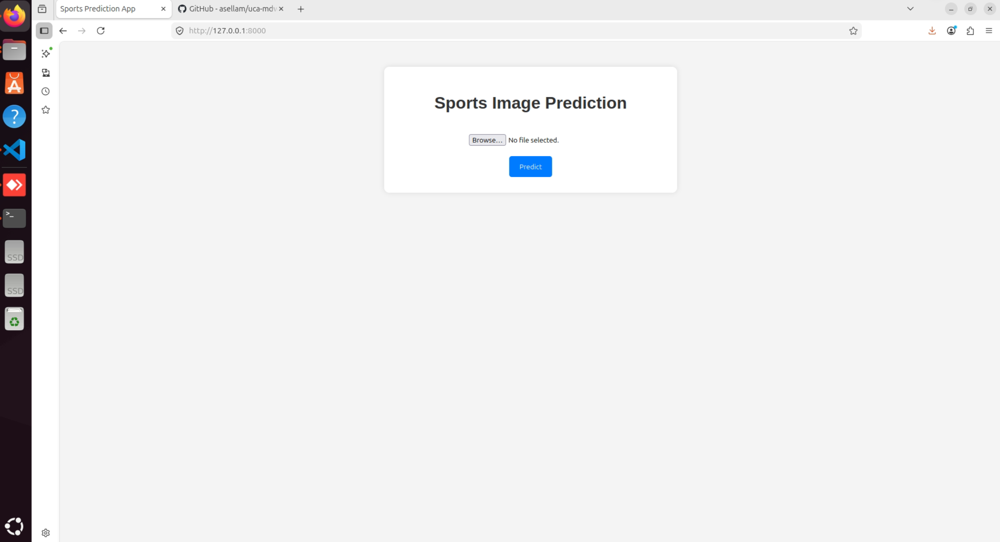
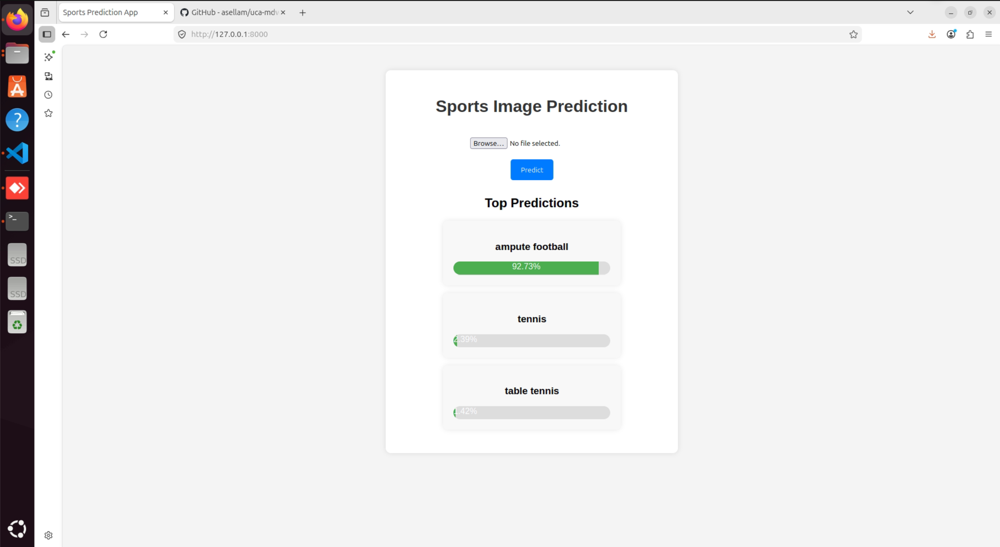

# 🏅 Sports Image Classification Web App (Django + Machine Learning)

This project is a **Django-based web application** for sports image classification using a pre-trained deep learning model provided by the instructor (Dr.Sellam).

The main contribution of this work is the **deployment of the trained model into a functional web system** that allows users to upload images and receive real-time predictions.

---

## 🎯 Project Objective

The goal of this project is to bridge the gap between **machine learning model development** and **real-world deployment** by:

* Integrating a pre-trained CNN model into a Django web framework
* Providing an interactive interface for end users
* Enabling real-time image classification

---

## 🧠 Model Information

* Source: Pre-trained model provided by the instructor (Salam)
* Format: `.keras`
* Task: Multi-class sports image classification
* Output: Probability distribution over sports categories

---

## ⚙️ My Contribution

In this project, I performed the following:

* 📥 Downloaded and integrated the pre-trained model
* 🌐 Created a full Django web application
* 🔌 Implemented model loading and inference pipeline
* 🖼️ Built image upload functionality
* 📊 Displayed top prediction results with confidence scores
* 🚀 Deployed the model in a local web environment

---

## 🏗️ System Architecture

User → Django Web Interface → Image Preprocessing → CNN Model → Softmax Output → Result Page

---

## 📸 Interface Preview

### 🏠 Home Page



### 📊 Prediction Result



---

## 🖼️ How It Works

1. User uploads a sports image
2. Image is resized to model input size (224×224)
3. Normalization is applied (0–1 scaling)
4. Model predicts class probabilities
5. Top-3 predictions are returned
6. Results are displayed on the result page

---

## ⚙️ Tech Stack

* Django (Backend Framework)
* TensorFlow / Keras (Deep Learning Model)
* NumPy (Data processing)
* Pillow (Image handling)
* HTML / CSS (Frontend)

---
## ▶️ How to Run Locally

### 1. Clone repository

```bash
git clone https://github.com/Metidji/Sports-Classification-Django-Machine-Learning-.git
cd Sports-Classification-Django-Machine-Learning
```

---

### 2. Create virtual environment

```bash
python -m venv venv
```

Activate:

**Windows**

```bash
venv\Scripts\activate
```

**Linux / Mac**

```bash
source venv/bin/activate
```

---

### 3. Install dependencies

```bash
pip install -r requirements.txt
```

---

### 4. Run server

```bash
python manage.py runserver
```

Open in browser:

```
http://127.0.0.1:8000/
```

---

## 📊 Example Output

```json
[
  {
    "class": "basketball",
    "confidence": 93.72
  },
  {
    "class": "volleyball",
    "confidence": 4.18
  },
  {
    "class": "tennis",
    "confidence": 2.10
  }
]
```

---


## 📌 Conclusion

This project demonstrates how a trained deep learning model can be successfully deployed into a real-world web application using Django, transforming a research model into a usable AI system.

---

## 📄 License

This project is for educational purposes only.
